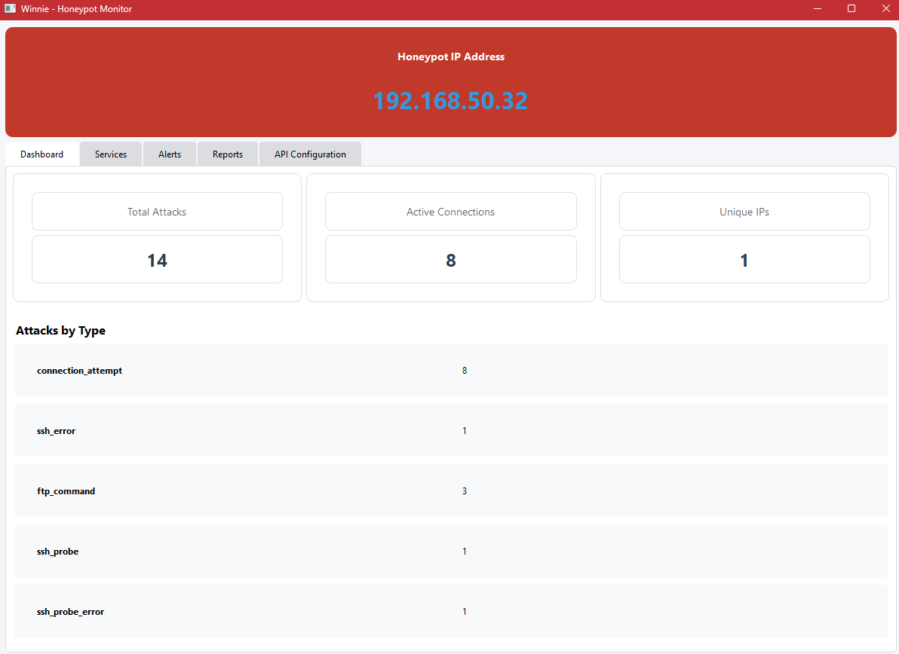
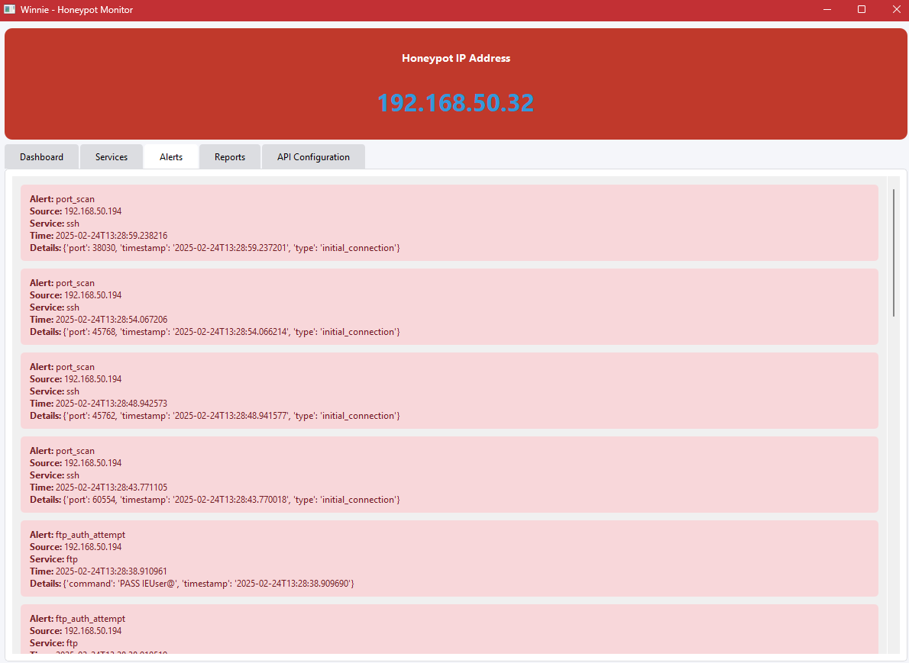
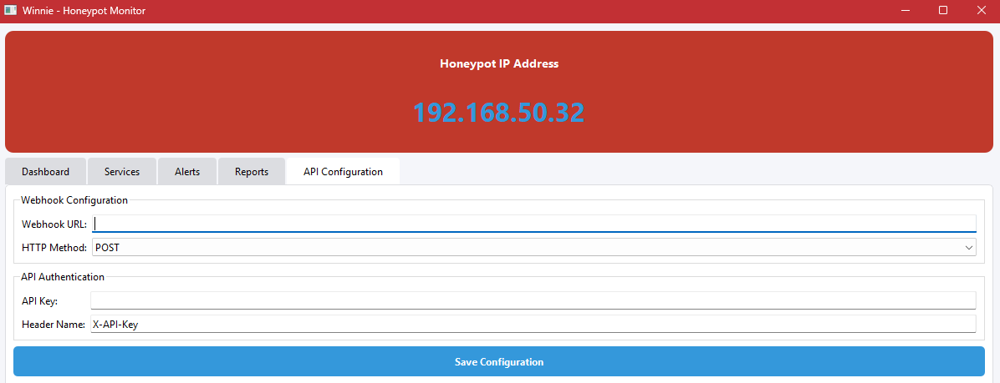
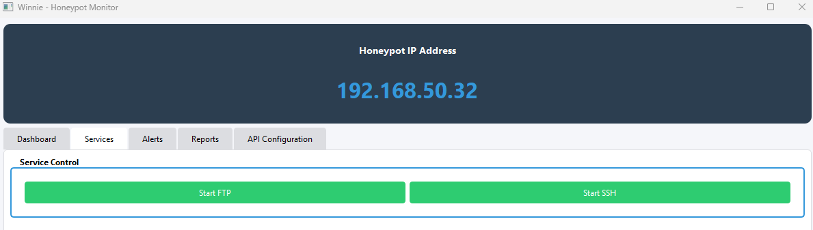

# Winnie - Honeypot Monitor

Winnie is a modern, user-friendly honeypot monitoring system designed to detect, track, and analyze potential security threats. It provides real-time monitoring of FTP and SSH services, with an intuitive graphical interface for security analysis.



## Features

- **Real-time Monitoring**
  - FTP honeypot service
  - SSH honeypot service
  - Live connection tracking
  - Active threat detection

- **Interactive Dashboard**
  - Total attack counter
  - Active connections display
  - Unique IP tracking
  - Attack type breakdown

- **Advanced Alerting**
  - Real-time alert notifications
  - Color-coded severity levels
  - Detailed attack information
  - Configurable alert rules

- **Reporting System**
  - Generate detailed reports
  - Attack statistics
  - Historical data analysis
  - Export capabilities

- **API Integration**
  - Webhook support
  - Custom API endpoints
  - Configurable authentication
  - External system integration



## Installation

1. Clone the repository:
```bash
git clone https://github.com/godofthunder8756/winnie.git
cd winnie
```

2. Create and activate a virtual environment:
```bash
python -m venv .venv
source .venv/bin/activate  # Linux/Mac
# or
.venv\Scripts\activate     # Windows
```

3. Install dependencies:
```bash
pip install -r requirements.txt
```

## Usage

1. Start the application:
```bash
python src/main.py
```

2. Configure services in the "Services" tab:
   - Click "Start FTP" to enable FTP honeypot
   - Click "Start SSH" to enable SSH honeypot

3. Monitor activity:
   - View real-time statistics in the Dashboard
   - Check alerts in the Alerts tab
   - Generate reports in the Reports tab

## Configuration

### API Integration
1. Navigate to the "API Configuration" tab
2. Enter your webhook URL
3. Configure authentication details
4. Save the configuration

### Service Ports
- FTP Service: Default port 21
- SSH Service: Default port 2222

## Requirements

- Python 3.8+
- PyQt6
- paramiko
- Additional requirements in `requirements.txt`

## Project Structure

```
winnie/
├── src/
│   ├── core/           # Core functionality
│   ├── services/       # Honeypot services
│   ├── ui/            # User interface
│   └── main.py        # Application entry point
├── logs/              # Log files
├── reports/           # Generated reports
└── config/           # Configuration files
```

## Contributing

1. Fork the repository
2. Create a feature branch
3. Commit your changes
4. Push to the branch
5. Create a Pull Request

## Security Considerations

- Run honeypots in controlled environments
- Monitor system resources
- Review logs regularly
- Keep the software updated

## License

This project is licensed under the MIT License - see the [LICENSE](LICENSE) file for details.

## Acknowledgments

- PyQt6 for the GUI framework
- Paramiko for SSH implementation

## Support

For support, please:
1. Check the documentation
2. Search existing issues
3. Create a new issue if needed

---
Created with ☕ by Aidan Ahern

